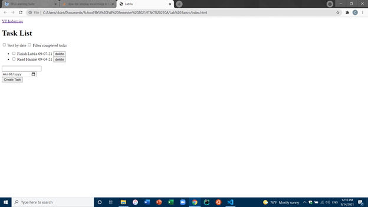
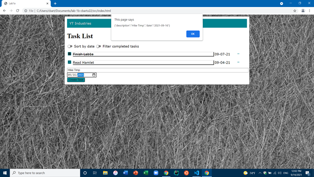

Caleb Barton 13 September 2021
# Lab 1 Write Up
## Executive Summary
After completing this project I better understand how to create basic websites and make them look more pleasing using CSS. I also understand how to host a webstite better but I would like more practice on the process because I don't quite have it nailed down yet. 
## Design Overview
### First Result

### Final Result

## Questions
**What is the purpose of using Docker containers?**
It runs a virtual server on your computer allowing you to "host" a website as if it were on another server but its just on your local machine.

**Why is it useful to have both a development environment and a live server environment?**
So you don't have to continually take your website off-line in order to make changes. All you have to do is simply redirect the changes you made in your development environment to the live server. 

**What is the purpose of using a code versioning tool (i.e. Git)?**
So you can share and work on code with other people. 

**What is the difference between a CSS rule with an element selector and one with a class selector? When would you use each?** 
A class selector is used for multiple elements, and rule is used with one unique ID in the HTML document. You would use either or both depending on how many elements you are trying to manipulate. 

**What are the advantages of putting your styles in a separate .css stylesheet instead of in the style> element of head>?**
Because it keeps your code cleaner.

**How do web browsers choose which CSS to use for an HTML element when the CSS rules contradict each other?**
The browser will choose the one that is the most specific. 

**Why should you disable directory access for your server?**
To prevent attacks and maintain security. 

## Lessons Learned
### Apache2 Server setup
This was a problem for me because when I was first trying to set it up I was doing it logged in on my local computer in the Ubuntu terminal, and then I tried refreshing my website after I had remoted into the AWS console from my computer, and my website didn't work so I unistalled it from my local computer and set it up on my server. 
### Favicon Problems
Adding a favicon is very straightforward, and I followed the instructions exactly as mentioned. After many hard refreshes though, it still wouldn't appear. A TA ended up helping solve the  problem by clearing the browsing data in my browser. 
### Image Locating
Getting images to show was more difficult than I thought. I have done web programming before, and I was always pretty good at it. This time I couldn't local images to show up, but after correcting syntax and the path I was able to get everything working. 
## Conclusions
<ul>
    <li> Proficient in HTML
    <li> Correctly configure a webpage to be hosted on the internet
    <li> Understand basic Javascript and CSS
    <li> Webpage design principles
    <li> Command line proficiency
    <li> Using docker containers
</ul>

## References
<ul>
    <li> Stack Overflow
    <li> W3Schools.org
    <li> Github
    <li> Lab procedures
    <li> YouTube
    <li> IT&C 210A webpages and tutorials
    <li> Visual Studio code help tutorials
</ul>